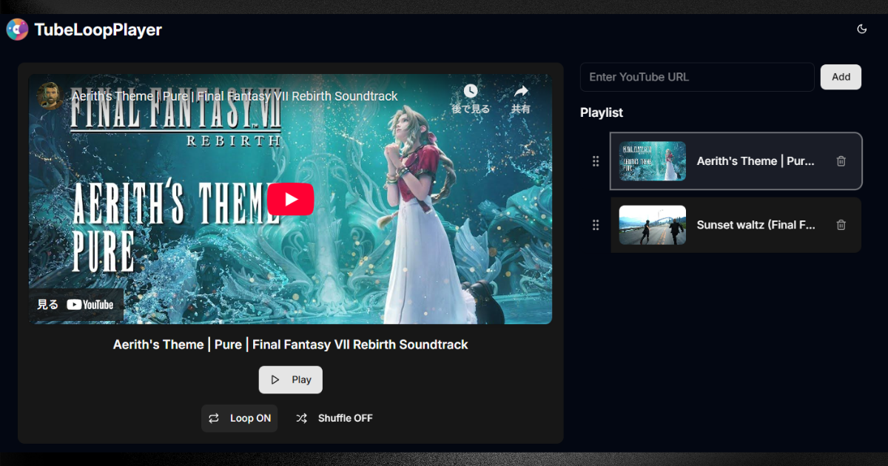

# TubeLoopPlayer

> Seamless YouTube Playlist Looping



## About The Project

TubeLoopPlayer is a web application designed for looping YouTube videos and playlists seamlessly. Create your own custom playlists and enjoy uninterrupted playback for studying, working, relaxing, or any occasion.

## Features

- **Custom Playlists**: Easily create your own playlists from YouTube video or playlist URLs.
- **Flexible Playback**: Change the playback order with drag-and-drop, and use loop (all/single) and shuffle modes.
- **Persistent Storage**: Your playlists are saved in your browser's cookies, so you can pick up where you left off.
- **Theme Support**: Switch between light and dark modes for your viewing comfort.
- **Simple Interface**: An intuitive and user-friendly UI.

## Built With

- [React](https://react.dev/)
- [Remix](https://remix.run/)
- [TypeScript](https://www.typescriptlang.org/)
- [Tailwind CSS](https://tailwindcss.com/)
- [Vite](https://vitejs.dev/)

## Getting Started

To get a local copy up and running, follow these simple steps.

### Installation

1. Clone the repo

   ```sh
   git clone https://github.com/your_username/tube-loop-player.git
   ```

2. Install NPM packages

   ```sh
   npm install
   ```

### Development

Start the development server with HMR:

```bash
npm run dev
```

Your application will be available at `http://localhost:5173`.

## License

Distributed under the MIT License. See `LICENSE` for more information.
